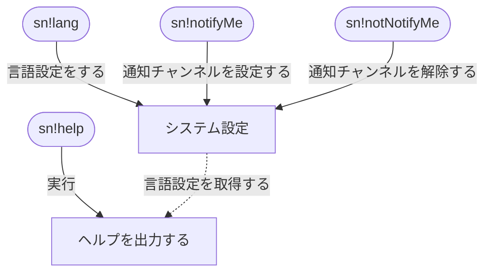

# 仕様書
配信の通知をするDiscord Bot

## 対応プラットフォーム
* Twitch

## コマンド
### 言語設定
言語設定をする  
```
sn!lang [OPTION]
```

#### OPTION
|key|args|detail|
|:--|:--|:--|
|ja|-|日本語|
|en|-|英語|

### 通知チャンネル設定
通知チャンネルを設定する  
```
sn!notifyMe
```

通知チャンネル設定を解除する
```
sn!notNotifyMe
```

### ヘルプ
ヘルプ表示する
```
sn!help
```

## フローチャート
