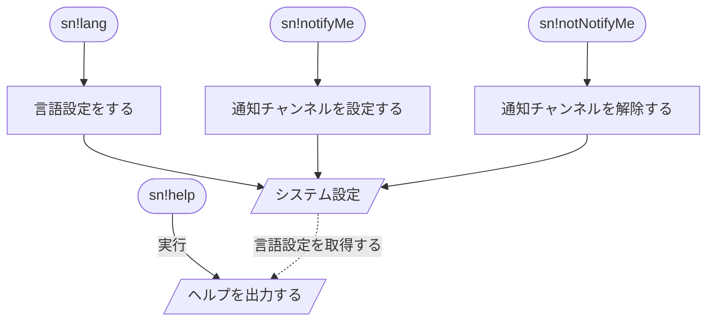

# 仕様書
配信の通知をするDiscord Bot

## 対応プラットフォーム
* Twitch

## コマンド
### 言語設定
* `sn!lang [OPTION]`
    * OPTION
        * `--ja`
        * `--en`

### 通知チャンネル設定
* `sn!notifyMe`
* `sn!notNotifyMe`

### ヘルプ
* `sn!help`

## フローチャート
